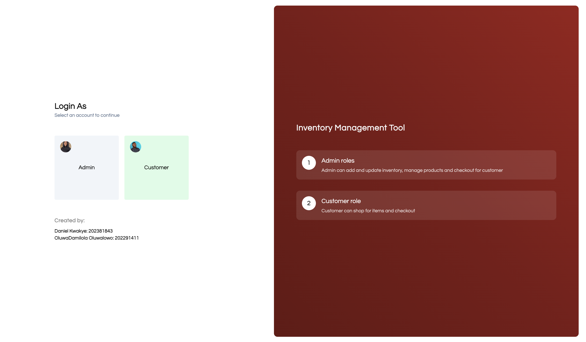
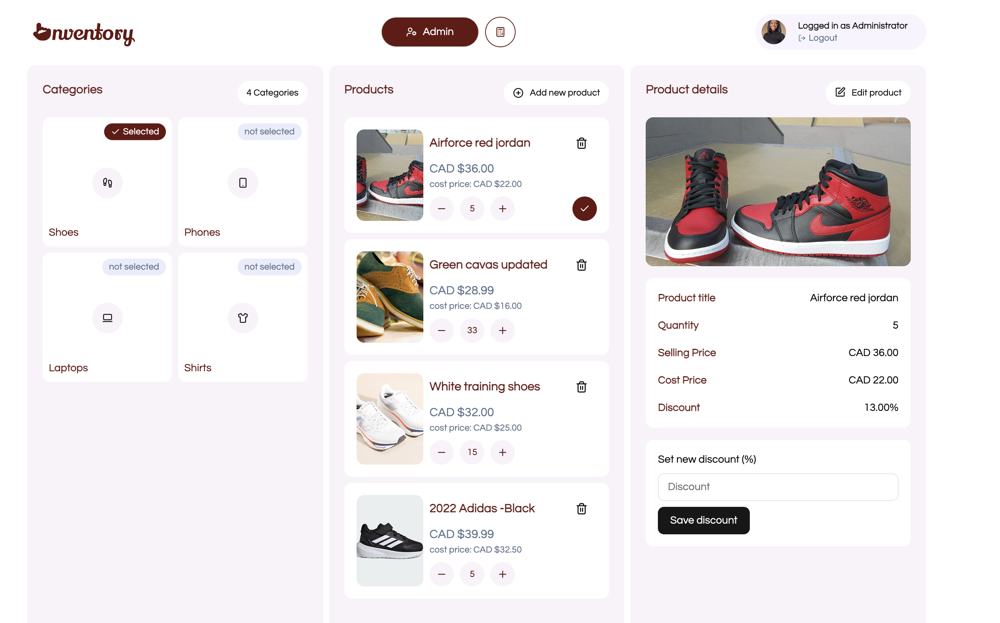
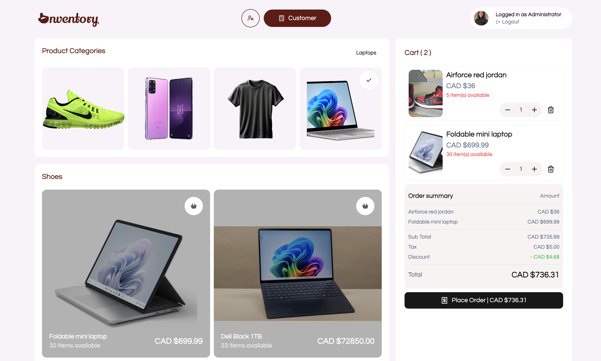

# 🧾 Inventory Management System – Python:Fast API Backend

This project implements inventory management using FastAPI (Python) as backend. It supports RESTful endpoints for product handling, stock updates, and checkout functionalities. The system adheres to a command-based architecture and leverages design patterns like singletons, factories, and strategies for scalable code reuse and maintenance.

## Screen Shots

## Features to expect:
- Adding, editing, and deleting products
- Managing stock levels
- Checkout operations

## Technical Details:

### source environment
`$source .venv/bin/activate`

### install required modules
`$pip install -f requirements.txt`

### run server
`$uvicorn main:app --reload`

### for deployment server the start cmd is
``

### To add new installations to requirements.txt
` $pip freeze > requirements.txt`

### To install new package
`$pip install [python-multipart]`